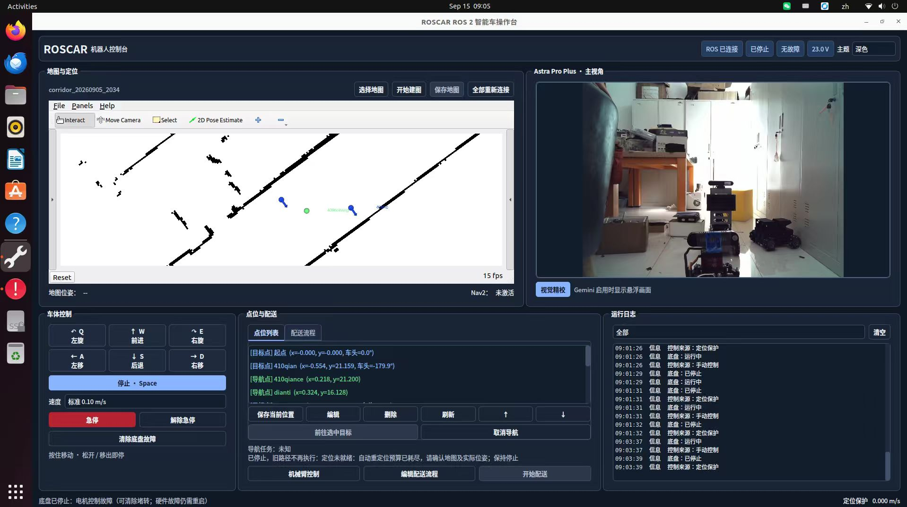
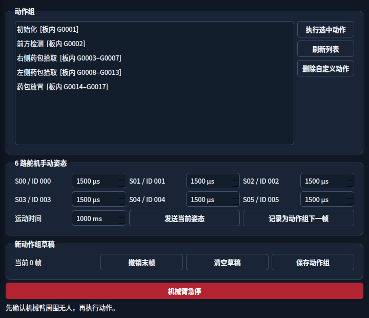
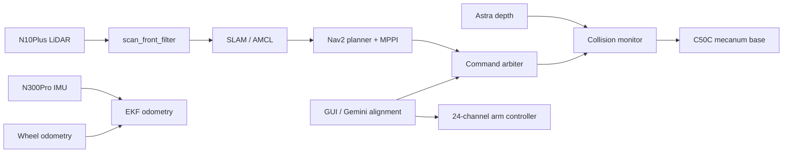

# 基于 ROS 2 的自主导航与视觉取放移动机器人

<p align="center">
  <a href="https://github.com/zhaowuc/ros2-autonomous-navigation-vision-pick-place-robot/releases/download/demo-video-v1/roscar-demo.mp4">
    
  </a>
</p>
<p align="center"><strong>▶ 点击上图播放完整演示视频</strong></p>

[](https://docs.ros.org/en/humble/)
[](https://releases.ubuntu.com/22.04/)
[](LICENSE)

面向室内配送场景的四轮麦克纳姆智能车工程。系统将激光建图与定位、深度避障、两阶段导航、机械臂动作组、视觉对齐和原生操作界面整合在一个 ROS 2 工作空间中。

## GUI 界面

<p align="center">
  
</p>

## 功能

- N10Plus 360° 激光建图，包含时间戳检查、运动补偿和远回波保护。
- 针对长走廊优化的 `slam_toolbox`：固定物理光束格、10 m 建图范围、保守回环校正。
- Nav2 两阶段控制：远距离差速巡航，目标附近切换麦轮全向精调。
- N300Pro IMU 与轮速融合里程计。
- Astra Pro Plus 深度点云辅助避障；Gemini Pro 用于目标平台视觉对齐。
- 众灵 24 路舵机板动作组驱动和可编辑动作序列。
- 配送流程：目标 101 → 视觉对齐与左侧取放 → 目标 102 → 视觉对齐与右侧取放 → 起点。
- 串口零速握手、急停、故障清除与有界自动恢复。
- PyQt 原生 GUI、RViz、Gazebo/伪 MCU 仿真与回归测试。



## 硬件参考

| 模块 | 作用 |
|---|---|
| WHEELTEC C50C | 四轮麦克纳姆底盘 |
| LSLiDAR N10Plus | 2D 建图、定位和障碍检测 |
| N300Pro IMU | 角速度与融合里程计 |
| Orbbec Astra Pro Plus | 前方深度障碍点云 |
| Orbbec Gemini Pro | 到点后的红色目标平台对齐 |
| 众灵 24 路舵机控制板 | 板内动作组和机械臂控制 |

设备路径按机器实际情况配置。公开版本使用 `/dev/c50c_ros`、`/dev/n300_imu`、`/dev/n10plus_lidar` 和 `/dev/roscar_arm` 作为建议的稳定别名，不包含作者设备序列号。

## 构建

系统基线为 Ubuntu 22.04 + ROS 2 Humble。

```bash
git clone https://github.com/zhaowuc/roscar-mobile-manipulator-ros2.git
cd roscar-mobile-manipulator-ros2
source /opt/ros/humble/setup.bash
bash install_dependencies.sh
rosdep install --from-paths src --ignore-src -r -y
colcon build --symlink-install
source install/setup.bash
```

首次接入串口设备时，将当前用户加入 `dialout` 组，并按各硬件目录中的 udev 规则创建稳定别名。

## 仿真

```bash
source /opt/ros/humble/setup.bash
source install/setup.bash
ros2 launch roscar_gazebo_sim demo_sim.launch.py
```

仿真包含确定性底盘、地图、Nav2 路径和速度链检查；详细入口位于 `src/roscar_gazebo_sim/scripts/`。

## 实车建图

```bash
source /opt/ros/humble/setup.bash
source install/setup.bash
ros2 launch roscar_bringup mapping.launch.py \
  use_real_hardware:=true \
  base_backend:=serial \
  serial_device:=/dev/c50c_ros \
  use_gui:=true use_rviz:=true
```

走廊建图默认使用原始精细角度扫描，运动补偿后归入 540 个固定物理光束格，避免稀疏 5400 格压低 Karto 匹配评分。保存地图：

```bash
ros2 run roscar_slam save_map --name my_map
```

## 实车导航

```bash
ros2 launch roscar_nav navigation.launch.py \
  use_real_hardware:=true \
  base_backend:=serial \
  serial_device:=/dev/c50c_ros \
  map:=/absolute/path/to/my_map.yaml
```

GUI 手动控制：W/S 前后、A/D 横移、Q/E 旋转、空格停车。地图、点位和机械臂自定义动作属于运行数据，不提交到仓库。

## 测试

```bash
colcon test --event-handlers console_direct+
colcon test-result --verbose
```

关键回归覆盖串口协议、故障恢复、运动学、扫描处理、走廊匹配、定位搜索、Nav2 配置、配送流程和视觉处理。

## 安全

- 首次测试底盘时架空车轮并保持急停可用。
- 调试机械臂前固定底座并清空运动范围。
- 视觉和深度传感器不能替代机械限位或现场监督。
- 不要把地图、标定点、密码、私钥和设备序列号提交到公开仓库。

项目原创代码使用 [MIT License](LICENSE)。仓库内引入的 LSLiDAR、SLAM Toolbox 与 Karto 代码保留其原许可证，详见 [THIRD_PARTY_NOTICES.md](THIRD_PARTY_NOTICES.md)。
